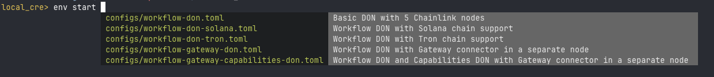

# Local CRE environment

The local CRE is developer environment for full stack development of the CRE platform. It deploys and configures DONs, capabilities, contracts, and observability, and optional features. It is built on Docker.

## Contact Us
Slack: #topic-local-dev-environments

## Table of content

[QUICKSTART](#quickstart)
1. [Using the CLI](#using-the-cli)
   - [Installing the binary](#installing-the-binary)
   - [Prerequisites (for Docker)](#prerequisites-for-docker)
   - [Setup](#setup)
   - [Start Environment](#start-environment)
      - [Using Existing Docker plugins image](#using-existing-docker-plugins-image)
      - [Beholder](#beholder)
      - [Storage](#storage)
   - [Purging environment state](#purging-environment-state)
   - [Stop Environment](#stop-environment)
   - [Restart Environment](#restarting-the-environment)
   - [Debugging core nodes](#debugging-core-nodes)
   - [Debugging capabilities (mac)](#debugging-capabilities-mac)
   - [Workflow Commands](#workflow-commands)
   - [Additional Workflow Sources](#additional-workflow-sources)
     - [Overview](#additional-sources-overview)
     - [Configuration](#additional-sources-configuration)
     - [File Source JSON Format](#file-source-json-format)
     - [Helper Tool: generate_file_source](#helper-tool-generate_file_source)
     - [Deploying a File-Source Workflow](#deploying-a-file-source-workflow)
     - [Mixed Sources (Contract + File)](#mixed-sources-contract--file)
     - [Pausing and Deleting File-Source Workflows](#pausing-and-deleting-file-source-workflows)
     - [Key Behaviors](#additional-sources-key-behaviors)
     - [Debugging Additional Sources](#debugging-additional-sources)
   - [Further use](#further-use)
   - [Advanced Usage](#advanced-usage)
   - [Testing Billing](#testing-billing)
   - [DX Tracing](#dx-tracing)
2. [Job Distributor Image](#job-distributor-image)
3. [Example Workflows](#example-workflows)
   - [Available Workflows](#available-workflows)
   - [Deployable Example Workflows](#deployable-example-workflows)
   - [Manual Workflow Deployment](#manual-workflow-deployment)
4. [Adding a New Standard Capability](#adding-a-new-standard-capability)
   - [Capability Types](#capability-types)
   - [Step 1: Define the Capability Flag](#step-1-define-the-capability-flag)
   - [Step 2: Create the Capability Implementation](#step-2-create-the-capability-implementation)
   - [Step 3: Optional Gateway Handler Configuration](#step-3-optional-gateway-handler-configuration)
   - [Step 4: Optional Node Configuration Modifications](#step-4-optional-node-configuration-modifications)
   - [Step 5: Add Default Configuration](#step-5-add-default-configuration)
   - [Step 6: Register the Capability](#step-6-register-the-capability)
   - [Step 7: Add to Environment Configurations](#step-7-add-to-environment-configurations)
   - [Configuration Templates](#configuration-templates)
   - [Important Notes](#important-notes)
5. [Multiple DONs](#multiple-dons)
   - [Supported Capabilities](#supported-capabilities)
   - [DON Types](#don-types)
   - [TOML Configuration Structure](#toml-configuration-structure)
   - [Example: Adding a New Topology](#example-adding-a-new-topology)
   - [Configuration Modes](#configuration-modes)
   - [Port Management](#port-management)
   - [Important Notes](#important-notes-1)
6. [Enabling Already Implemented Capabilities](#enabling-already-implemented-capabilities)
   - [Available Configuration Files](#available-configuration-files)
   - [Capability Types and Configuration](#capability-types-and-configuration)
   - [Binary Requirements](#binary-requirements)
   - [Enabling Capabilities in Your Topology](#enabling-capabilities-in-your-topology)
   - [Configuration Examples](#configuration-examples)
   - [Custom Capability Configuration](#custom-capability-configuration)
   - [Important Notes](#important-notes-2)
   - [Troubleshooting Capability Issues](#troubleshooting-capability-issues)
7. [Binary Location and Naming](#binary-location-and-naming)
8. [Hot swapping](#hot-swapping)
   - [Chainlink nodes' Docker image](#chainlink-nodes-docker-image)
   - [Capability binary](#capability-binary)
   - [Automated Hot Swapping with fswatch](#automated-hot-swapping-with-fswatch)
9. [Telemetry Configuration](#telemetry-configuration)
   - [OTEL Stack (OpenTelemetry)](#otel-stack-opentelemetry)
   - [Chip Ingress (Beholder)](#chip-ingress-beholder)
   - [Expected Error Messages](#expected-error-messages)
10. [Using a Specific Docker Image for Chainlink Node](#using-a-specific-docker-image-for-chainlink-node)
11. [Using Existing EVM & P2P Keys](#using-existing-evm--p2p-keys)
12. [TRON Integration](#tron-integration)
    - [How It Works](#how-it-works)
    - [Example Configuration](#example-configuration)
13. [Connecting to external/public blockchains](#connecting-to-externalpublic-blockchains)
14. [Kubernetes Deployment](#kubernetes-deployment)
    - [Prerequisites](#prerequisites-for-kubernetes)
    - [Configuration](#kubernetes-configuration)
    - [Config and Secrets Overrides](#config-and-secrets-overrides)
    - [Example Configuration](#kubernetes-example-configuration)
15. [Troubleshooting](#troubleshooting)
    - [Chainlink Node Migrations Fail](#chainlink-node-migrations-fail)
    - [Docker Image Not Found](#docker-image-not-found)
    - [Docker fails to download public images](#docker-fails-to-download-public-images)
    - [GH CLI is not installed](#gh-cli-is-not-installed)

# QUICKSTART
Setup platform: allocate and configure the default environment with all dependencies. :rocket:
```
go run . env start --auto-setup
```
Note: this allocates and configures the full stack. It may take a few minutes the first time.

Deploy app: your first workflow
```
go run . workflow deploy -w ./examples/workflows/v2/cron/main.go -n cron_example
```

<!-- TODO: add observe. The intro should be ~ setup platform, deploy app, observe -->
# Using the CLI

The CLI manages CRE test environments. It is located in `core/scripts/cre/environment`. It doesn't come as a compiled binary, so every command has to be executed as `go run . <command> [subcommand]` (although check below!).

## Installing the binary
You can compile and install the binary by running:
```shell
cd core/scripts/cre/environment
make install
```

It will compile local CRE as `local_cre`. With it installed you will be able to access interactive shell **with autocompletions** by running `local_cre sh`. Without installing the binary interactive shell won't be available.



> Warning: Control+C won't interrupt commands executed via the interactive shell.

## Prerequisites (for Docker) ###
1. **Docker installed and running**
    - with usage of default Docker socket **enabled**
    - with Apple Virtualization framework **enabled**
    - with VirtioFS **enabled**
    - with use of containerd for pulling and storing images **disabled**
2. **AWS SSO access to SDLC** or **Access to Git repositories**
  AWS:
  - REQUIRED: `staging-default` profile (with `DefaultEngineeringAccess` role)
>  [See more for configuring AWS in CLL](https://smartcontract-it.atlassian.net/wiki/spaces/INFRA/pages/1045495923/Configure+the+AWS+CLI)
  Git repositories:
  - REQUIRED: read access to [Atlas](https://github.com/smartcontractkit/atlas) and [Capabilities](https://github.com/smartcontractkit/capabilities) and [Job Distributor](https://github.com/smartcontractkit/job-distributor) repositories

  Either AWS or Git access is required in order to pull/build Docker images for:
  - Chip Ingress (Beholder stack)
  - Chip Config (Beholder stack)
  - Job Distributor

  Git access to `Capabilities` repository is required in order to build capability binaries. Unless you plan on only using Docker images with all capabilities baked in.

# QUICKSTART
```
# e.g. AWS_ECR=<PROD_ACCOUNT_ID>.dkr.ecr.<REGION>.amazonaws.com
AWS_ECR=<PROD_AWS_URL> go run . env start --auto-setup
```
> You can find `PROD_ACCOUNT_ID` and `REGION` in the `[profile prod]` section of the [AWS CLI configuration guide](https://smartcontract-it.atlassian.net/wiki/spaces/INFRA/pages/1045495923/Configure+the+AWS+CLI#Configure). If for some reason you want to limit the AWS config to bare minimum, include only `staging-default` profile and `cl-secure-sso` session entries.

If you are missing requirements, you may need to fix the errors and re-run.

Refer to [this document](https://docs.google.com/document/d/1HtVLv2ipx2jvU15WYOijQ-R-5BIZrTdAaumlquQVZ48/edit?tab=t.0#heading=h.wqgcsrk9ncjs) for troubleshooting and FAQ. Use `#topic-local-dev-environments` for help.

## Setup

Environment can be setup by running `go run . env setup` inside `core/scripts/cre/environment` folder. Its configuration is defined in [configs/setup.toml](configs/setup.toml) file. It will make sure that:
- you have AWS CLI installed and configured
- you have GH CLI installed and authenticated
- you have required Job Distributor, Chip Ingress, and Chip Config images
- install and copy all capability binaries to expected location

**Image Versioning:**

Docker images for Beholder services (chip-ingress, chip-config) use commit-based tags instead of mutable tags like `local-cre`. This ensures you always know which version is running and prevents hard-to-debug issues from version mismatches. The exact versions are defined in [configs/setup.toml](configs/setup.toml).

Capability installation is two fold. Private and local plugins are compiled locally and then copied to the running Docker container. Public plugins are installed, when the Docker image is built. The reason is that capability developers need a way to quickly test capabilities they are working on, without having to push the code to remote repository, so that it could be installed in the Docker image (and that's because local capability code is usually located outside Docker build context and thus unavailable).

Private capabilities are defined in [plugins.private.yaml](../../../../plugins/plugins.private.yaml) file, public in [plugins.public.yaml](../../../../plugins/plugins.public.yaml). Local ones include:
- `chainlink-evm`
- `chainlink-medianpoc`
- `chainlink-ocr3-capability`
- `log-event-trigger`

If you need to modify make commands that are used navigate to [configs/setup.toml](configs/setup.toml) file and adjust following lines:
```toml
[capabilities]
target_path = "./binaries"
# add "install-plugins-public" to also locally compile and copy public plugins (be aware chainlink-cosmos might fail due to issues with cross-compile)
make_commands = ["install-plugins-private", "install-plugins-local"]
```

## Start Environment
```bash
# while in core/scripts/cre/environment
go run . env start [--auto-setup]

# to start environment with an example workflow web API-based workflow
go run . env start --with-example

 # to start environment with an example workflow cron-based workflow (this requires the `cron` capability binary present in `/binaries` folder)
go run . env start --with-example --example-workflow-trigger cron

# to start environment using image with all supported capabilities
go run . env start --with-plugins-docker-image <SDLC_ACCOUNT_ID>dkr.ecr.<SDLC_ACCOUNT_REGION>.amazonaws.com/chainlink:nightly-<YYYMMDD>-plugins

# to start environment with local Beholder
go run . env start --with-beholder

# to start environment with legacy v1 contracts (default is v2)
go run . env start --with-contracts-version v1
```

> Important! **Nightly** Chainlink images are retained only for one day and built at 03:00 UTC. That means that in most cases you should use today's image, not yesterday's.

Optional parameters:
- `-a`: Check if all dependencies are present and if not install them (defaults to `false`)
- `-t`: Topology (`simplified` or `full`)
- `-w`: Wait on error before removing up Docker containers (e.g. to inspect Docker logs, e.g. `-w 5m`)
- `-e`: Extra ports for which external access by the DON should be allowed (e.g. when making API calls or downloading WASM workflows)
- `-x`: Registers an example PoR workflow using CRE CLI and verifies it executed successfuly
- `-s`: Time to wait for example workflow to execute successfuly (defaults to `5m`)
- `-p`: Docker `plugins` image to use (must contain all of the following capabilities: `ocr3`, `cron`, `readcontract` and `logevent`)
- `-y`: Trigger for example workflow to deploy (web-trigger or cron). Default: `web-trigger`. **Important!** `cron` trigger requires user to either provide the capbility binary path in TOML config or Docker image that has it baked in
- `--with-contracts-version`: Version of workflow/capability registries to use (`v2` by default, use `v1` explicitly for legacy coverage)

## Purging environment state
To remove all state and cache files used by the environment execute:
```bash
# while in core/scripts/cre/environment
go run . env state purge
```

This might be helpful if you suspect that state files might be corrupt and you're unable to start the environment.

### Using existing Docker Plugins image

If you don't want to build Chainlink image from your local branch (default behaviour) or you don't want to go through the hassle of downloading capabilities binaries in order to enable them on your environment you should use the `--with-plugins-docker-image` flag. It is recommended to use a nightly `core plugins` image that's build by [Docker Build action](https://github.com/smartcontractkit/chainlink/actions/workflows/docker-build.yml) as it contains all supported capability binaries.

### Beholder

When environment is started with `--with-beholder` or with `-b` flag after the DON is ready  we will boot up `Chip Ingress` and `Red Panda`, create a `cre` topic and download and install workflow-related protobufs from the [chainlink-protos](https://github.com/smartcontractkit/chainlink-protos/tree/main/workflows) repository.

Once up and running you will be able to access [CRE topic view](http://localhost:8080/topics/cre) to see workflow-emitted events. These include both standard events emitted by the Workflow Engine and custom events emitted from your workflow.

#### Filtering out heartbeats
Heartbeat messages spam the topic, so it's highly recommended that you add a JavaScript filter that will exclude them using the following code: `return value.msg !== 'heartbeat';`.

If environment is already running you can start just the Beholder stack (and register protos) with:
```bash
go run . env beholder start
```

**Image Requirements:**

Beholder requires `chip-ingress` and `chip-config` Docker images with specific versions defined in [configs/setup.toml](configs/setup.toml). The image tags use commit hashes for version tracking (e.g., `chip-ingress:da84cb72d3a160e02896247d46ab4b9806ebee2f`).

When starting Beholder, the system will:
- **In CI (`CI=true`)**: Skip image checks (docker-compose will pull at runtime)
- **Interactive terminal**: Auto-build missing images from sources. If build fails and `AWS_ECR` is set, you'll be offered to pull from ECR instead
- **Non-interactive (tests, scripts)**: Auto-pull from ECR if `AWS_ECR` is set, otherwise fail with instructions

To manually ensure images are available, run:
```bash
# Build from sources
go run . env setup

# Or pull from ECR (requires AWS SSO access)
AWS_ECR=<account-id>.dkr.ecr.us-west-2.amazonaws.com go run . env setup
```

### Storage

By default, workflow artifacts are loaded from the container's filesystem. The Chainlink nodes can only load workflow files from the local filesystem if `WorkflowFetcher` uses the `file://` prefix. Right now, it cannot read workflow files from both the local filesystem and external sources (like S3 or web servers) at the same time.

The environment supports two storage backends for workflow uploads:
- Gist (requires deprecated CRE CLI, remote)
- S3 MinIO (built-in, local)

Configuration details for the CRE CLI are generated automatically into the `cre.yaml` file
(path is printed after starting the environment).

For more details on the URL resolution process and how workflow artifacts are handled, see the [URL Resolution Process](../../../../system-tests/tests/smoke/cre/guidelines.md#url-resolution-process) section in `system-tests/tests/smoke/cre/guidelines.md`.

## Stop Environment
```bash
# while in core/scripts/cre/environment
go run . env stop

# or... if you have the CTF binary
ctf d rm
```
---

## Restarting the environment

If you are using Blockscout and you restart the environment **you need to restart the block explorer** if you want to see current block history. If you don't you will see stale state of the previous environment. To restart execute:
```bash
ctf bs r
```
---

## Debugging core nodes
Before start the environment set the `CTF_CLNODE_DLV` environment variable to `true`
```bash
export CTF_CLNODE_DLV="true"
```
Nodes will open a Delve server on port `40000 + node index` (e.g. first node will be on `40000`, second on `40001` etc). You can connect to it using your IDE or `dlv` CLI.

## Debugging capabilities (mac)
Build the capability with the following flags (this ensures that the binary is not run using rosetta as this prevents dlv from attaching)
```bash
GOOS=linux GOARCH=arm64 go build -gcflags "all=-N -l" -o <capability binary name>
```
Copy the capability binary to `core/scripts/cre/environment/binaries` folder.

Add or update the `custom_ports` entry in the topology file (e.g., `core/scripts/cre/environment/configs/workflow-gateway-don.toml`) to include the port mapping for the Delve debugger. For example:
```toml
custom_ports = ["5002:5002", "15002:15002", "45000:45000"]
```

Start the environment and verify that the container is exposing the new port.  Start a shell session on the relevant container, e.g:
```bash
docker exec -it workflow-node1 /bin/bash
```

In the shell session list all processes (`ps -aux`) and identify the PID of the capability you want to debug.  Also, verify
that rosetta is not being used to run the capability binary that you want to debug.

Attach dlv to the capability process using the PID you identified above, e.g:
```bash
dlv attach <PID> --headless --listen=:45000 --api-version=2 --accept-multiclient
```

Attach your IDE to the dlv server on port `45000` (or whatever port you exposed).


## Workflow Commands

The environment provides workflow management commands defined in `core/scripts/cre/environment/environment/workflow.go`:

### `workflow deploy`
Compiles and uploads a workflow to the environment by copying it to workflow nodes and registering with the workflow registry. It checks if a workflow with same name already exists and deletes it, if it does.

**Usage:**
```bash
go run . workflow deploy [flags]
```

**Key flags:**
- `-w, --workflow-file-path`: Path to the workflow file (default: `./examples/workflows/v2/cron/main.go`)
- `-c, --config-file-path`: Path to the config file (optional)
- `-s, --secrets-file-path`: Path to the secrets file (optional)
- `-t, --container-target-dir`: Path to target directory in Docker container (default: `/home/chainlink/workflows`)
- `-o, --container-name-pattern`: Pattern to match container name (default: `workflow-node`)
- `-n, --workflow-name`: Workflow name (default: `exampleworkflow`)
- `-r, --rpc-url`: RPC URL (default: `http://localhost:8545`)
- `-i, --chain-id`: Chain ID (default: `1337`)
- `-a, --workflow-registry-address`: Workflow registry address (default: `0x9fE46736679d2D9a65F0992F2272dE9f3c7fa6e0`)
- `-b, --capabilities-registry-address`: Capabilities registry address (default: `0xe7f1725E7734CE288F8367e1Bb143E90bb3F0512`)
- `-d, --workflow-owner-address`: Workflow owner address (default: `0xf39fd6e51aad88f6f4ce6ab8827279cfffb92266`)
- `-e, --don-id`: DON ID (default: `1`)

**Example:**
```bash
go run . workflow deploy -w ./my-workflow.go -n myworkflow -c ./config.yaml
```

### `workflow delete`
Deletes a specific workflow from the workflow registry contract (but doesn't remove it from Docker containers).

**Usage:**
```bash
go run . workflow delete [flags]
```

**Key flags:**
- `-n, --name`: Workflow name to delete (default: `exampleworkflow`)
- `-r, --rpc-url`: RPC URL (default: `http://localhost:8545`)
- `-i, --chain-id`: Chain ID (default: `1337`)
- `-a, --workflow-registry-address`: Workflow registry address (default: `0x9fE46736679d2D9a65F0992F2272dE9f3c7fa6e0`)
- `-d, --workflow-owner-address`: Workflow owner address (default: `0xf39fd6e51aad88f6f4ce6ab8827279cfffb92266`)

**Example:**
```bash
go run . workflow delete -n myworkflow
```

### `workflow delete-all`
Deletes all workflows from the workflow registry contract.

**Usage:**
```bash
go run . workflow delete-all [flags]
```

**Key flags:**
- `-r, --rpc-url`: RPC URL (default: `http://localhost:8545`)
- `-i, --chain-id`: Chain ID (default: `1337`)
- `-a, --workflow-registry-address`: Workflow registry address (default: `0x9fE46736679d2D9a65F0992F2272dE9f3c7fa6e0`)
- `-d, --workflow-owner-address`: Workflow owner address (default: `0xf39fd6e51aad88f6f4ce6ab8827279cfffb92266`)

**Example:**
```bash
go run . workflow delete-all
```

### `workflow deploy-and-verify-example`
Deploys and verifies the example workflow.

**Usage:**
```bash
go run . workflow deploy-and-verify-example
```

This command uses default values and is useful for testing the workflow deployment process.

---

## Additional Workflow Sources

The workflow registry syncer supports multiple sources of workflow metadata beyond the on-chain contract. This enables flexible deployment scenarios including pure file-based or GRPC-based workflow deployments.

### Additional Sources Overview

Three source types are supported:

1. **ContractWorkflowSource** (optional): Reads from the on-chain workflow registry contract
2. **GRPCWorkflowSource** (additional): Fetches from external GRPC services
3. **FileWorkflowSource** (additional): Reads from a local JSON file

**Key Features:**
- Contract source is optional - enables pure GRPC-only or file-only deployments
- All additional sources (GRPC and file) are configured via unified `AdditionalSources` config
- Source type is auto-detected by URL scheme (`file://` for file, otherwise GRPC)

### Additional Sources Configuration

All additional sources are configured via the `AdditionalSources` config in TOML. The source type is auto-detected based on the URL scheme:

**File source (detected by `file://` prefix):**
```toml
[WorkflowRegistry]
Address = "0x1234..."  # Optional - leave empty for pure file-only deployments

[[WorkflowRegistry.AdditionalSources]]
Name = "local-file"
URL = "file:///tmp/workflows_metadata.json"
```

**GRPC source (URL without `file://` prefix):**
```toml
[WorkflowRegistry]
Address = "0x1234..."

[[WorkflowRegistry.AdditionalSources]]
Name = "private-registry"
URL = "grpc.private-registry.example.com:443"
TLSEnabled = true
```

**Pure GRPC-only deployment (no contract):**
```toml
[WorkflowRegistry]
# No Address = no contract source

[[WorkflowRegistry.AdditionalSources]]
Name = "private-registry"
URL = "grpc.private-registry.example.com:443"
TLSEnabled = true
```

### File Source JSON Format

The file source reads from the path specified in the URL (e.g., `/tmp/workflows_metadata.json`).

**JSON Schema:**
```json
{
  "workflows": [
    {
      "workflow_id": "<32-byte hex string without 0x prefix>",
      "owner": "<owner address hex without 0x prefix>",
      "created_at": "<unix timestamp>",
      "status": "<0=active, 1=paused>",
      "workflow_name": "<name>",
      "binary_url": "<URL to fetch binary - same format as contract>",
      "config_url": "<URL to fetch config - same format as contract>",
      "tag": "<version tag>",
      "attributes": "<optional JSON string>",
      "don_family": "<DON family name>"
    }
  ]
}
```

**Example:**
```json
{
  "workflows": [
    {
      "workflow_id": "0102030405060708091011121314151617181920212223242526272829303132",
      "owner": "f39fd6e51aad88f6f4ce6ab8827279cfffb92266",
      "created_at": 1733250000,
      "status": 0,
      "workflow_name": "my-file-workflow",
      "binary_url": "file:///home/chainlink/workflows/my_workflow.wasm",
      "config_url": "file:///home/chainlink/workflows/my_config.json",
      "tag": "v1.0.0",
      "don_family": "workflow"
    }
  ]
}
```

See [examples/workflows_metadata_example.json](./examples/workflows_metadata_example.json) for a reference file.

### Helper Tool: generate_file_source

A helper tool is provided to generate the workflow metadata JSON with the correct workflowID (which is a hash of the workflow artifacts):

```bash
cd core/scripts/cre/environment
go run ./cmd/generate_file_source \
  --binary /path/to/workflow.wasm \
  --config /path/to/config.json \
  --name my-workflow \
  --owner f39fd6e51aad88f6f4ce6ab8827279cfffb92266 \
  --output /tmp/workflows_metadata.json \
  --don-family workflow
```

**Additional flags:**
- `--binary-url-prefix`: Prefix for the binary URL in the output (e.g., `file:///home/chainlink/workflows/`)
- `--config-url-prefix`: Prefix for the config URL in the output

### Deploying a File-Source Workflow

This walkthrough demonstrates deploying a workflow via file source in a local CRE environment.

**Prerequisites:**
- Local CRE environment set up
- Docker running
- Go toolchain installed

**Step-by-step:**

```bash
# 1. Start the environment
cd core/scripts/cre/environment
go run . env start --auto-setup

# 2. Deploy a workflow via contract first (this creates the compiled binary in containers)
go run . workflow deploy -w ./examples/workflows/v2/cron/main.go -n cron_contract

# 3. Get the existing workflow binary from a container
docker cp workflow-node1:/home/chainlink/workflows/cron_contract.wasm /tmp/cron_contract.wasm

# 4. Generate the file source metadata with a DIFFERENT workflow name
go run ./cmd/generate_file_source \
  --binary /tmp/cron_contract.wasm \
  --name file_source_cron \
  --owner f39fd6e51aad88f6f4ce6ab8827279cfffb92266 \
  --output /tmp/workflows_metadata.json \
  --don-family workflow \
  --binary-url-prefix "file:///home/chainlink/workflows/" \
  --config-url-prefix "file:///home/chainlink/workflows/"

# 5. Copy the binary to all containers with new name
docker cp /tmp/cron_contract.wasm workflow-node1:/home/chainlink/workflows/file_source_workflow.wasm
docker cp /tmp/cron_contract.wasm workflow-node2:/home/chainlink/workflows/file_source_workflow.wasm
docker cp /tmp/cron_contract.wasm workflow-node3:/home/chainlink/workflows/file_source_workflow.wasm
docker cp /tmp/cron_contract.wasm workflow-node4:/home/chainlink/workflows/file_source_workflow.wasm
docker cp /tmp/cron_contract.wasm workflow-node5:/home/chainlink/workflows/file_source_workflow.wasm

# 6. Create an empty config file and copy to all containers
echo '{}' > /tmp/file_source_config.json
docker cp /tmp/file_source_config.json workflow-node1:/home/chainlink/workflows/file_source_config.json
docker cp /tmp/file_source_config.json workflow-node2:/home/chainlink/workflows/file_source_config.json
docker cp /tmp/file_source_config.json workflow-node3:/home/chainlink/workflows/file_source_config.json
docker cp /tmp/file_source_config.json workflow-node4:/home/chainlink/workflows/file_source_config.json
docker cp /tmp/file_source_config.json workflow-node5:/home/chainlink/workflows/file_source_config.json

# 7. Copy the metadata file to all nodes
docker cp /tmp/workflows_metadata.json workflow-node1:/tmp/workflows_metadata.json
docker cp /tmp/workflows_metadata.json workflow-node2:/tmp/workflows_metadata.json
docker cp /tmp/workflows_metadata.json workflow-node3:/tmp/workflows_metadata.json
docker cp /tmp/workflows_metadata.json workflow-node4:/tmp/workflows_metadata.json
docker cp /tmp/workflows_metadata.json workflow-node5:/tmp/workflows_metadata.json

# 8. Wait for the syncer to pick up the workflow (default 12 second interval)
# Check logs for "Loaded workflows from file" messages
docker logs workflow-node1 2>&1 | grep -i "file"

# 9. Verify the workflow is running
docker logs workflow-node1 2>&1 | grep -i "workflow engine"
```

### Mixed Sources (Contract + File)

You can run both contract-deployed and file-source workflows simultaneously:

```bash
# 1. Deploy workflow via contract
go run . workflow deploy -w ./examples/workflows/v2/cron/main.go -n contract_workflow

# 2. Add a different workflow via file source (follow steps 3-7 from above)

# 3. Verify both workflows are running
docker logs workflow-node1 2>&1 | grep -i "Aggregated workflows from all sources"
# Should show totalWorkflows: 2
```

### Pausing and Deleting File-Source Workflows

**Pausing a workflow** - Change the `status` field to `1`:

```bash
# Create updated metadata with status=1 (paused)
cat > /tmp/workflows_metadata_paused.json << 'EOF'
{
  "workflows": [
    {
      "workflow_id": "<YOUR_WORKFLOW_ID>",
      "owner": "f39fd6e51aad88f6f4ce6ab8827279cfffb92266",
      "status": 1,
      "workflow_name": "file_source_cron",
      "binary_url": "file:///home/chainlink/workflows/file_source_workflow.wasm",
      "config_url": "file:///home/chainlink/workflows/file_source_config.json",
      "don_family": "workflow"
    }
  ]
}
EOF

# Copy to all nodes
docker cp /tmp/workflows_metadata_paused.json workflow-node1:/tmp/workflows_metadata.json
docker cp /tmp/workflows_metadata_paused.json workflow-node2:/tmp/workflows_metadata.json
docker cp /tmp/workflows_metadata_paused.json workflow-node3:/tmp/workflows_metadata.json
docker cp /tmp/workflows_metadata_paused.json workflow-node4:/tmp/workflows_metadata.json
docker cp /tmp/workflows_metadata_paused.json workflow-node5:/tmp/workflows_metadata.json

# Wait for syncer to detect the change
docker logs workflow-node1 2>&1 | grep -i "paused"
```

**Deleting a workflow** - Remove it from the JSON file:

```bash
# Create empty metadata file
echo '{"workflows":[]}' > /tmp/empty_metadata.json

# Copy to all nodes
docker cp /tmp/empty_metadata.json workflow-node1:/tmp/workflows_metadata.json
docker cp /tmp/empty_metadata.json workflow-node2:/tmp/workflows_metadata.json
docker cp /tmp/empty_metadata.json workflow-node3:/tmp/workflows_metadata.json
docker cp /tmp/empty_metadata.json workflow-node4:/tmp/workflows_metadata.json
docker cp /tmp/empty_metadata.json workflow-node5:/tmp/workflows_metadata.json

# Contract workflows continue running; file-source workflow is removed
```

### Additional Sources Key Behaviors

**Source Aggregation:**
- Workflows from all sources are merged into a single list
- Only ContractWorkflowSource provides real blockchain head (block height/hash)
- For pure additional-source deployments, a synthetic head is created (Unix timestamp)
- If one source fails, others continue to work (graceful degradation)

**Contract Source Optional:**
- If no contract address is configured, the contract source is skipped
- Enables pure GRPC-only or file-only workflow deployments
- Synthetic heads are used when no contract source is present

**File Source Characteristics:**
- File is read on every sync interval (default 12 seconds)
- Missing file = empty workflow list (not an error)
- Invalid JSON entries are skipped with a warning
- File source is always "ready" (unlike contract source which needs initialization)

**GRPC Source:**
- Supports JWT-based authentication
- Includes automatic retry logic with exponential backoff (max 2 retries, 100ms-5s delay)
- Only transient errors (Unavailable, ResourceExhausted) are retried

**Source Tracking:**
- Each workflow includes a `Source` field identifying where it was deployed from
- Source identifiers: `ContractWorkflowSource`, `FileWorkflowSource`, `GRPCWorkflowSource`

### Debugging Additional Sources

**Check if file source is being read:**
```bash
docker logs workflow-node1 2>&1 | grep "Loaded workflows from file"
docker logs workflow-node1 2>&1 | grep "Workflow metadata file does not exist"
```

**Check aggregated workflows:**
```bash
docker logs workflow-node1 2>&1 | grep "Aggregated workflows from all sources"
docker logs workflow-node1 2>&1 | grep "fetching workflow metadata from all sources"
```

**Verify workflow engine started:**
```bash
docker logs workflow-node1 2>&1 | grep "Creating Workflow Engine for workflow spec"
```

**Key log messages:**
- `"Loaded workflows from file"` - File was successfully read
- `"Workflow metadata file does not exist"` - File doesn't exist (normal if not using file source)
- `"Source not ready, skipping"` - Contract source not yet initialized
- `"Aggregated workflows from all sources"` with `totalWorkflows` count - Sync completed
- `"All workflow sources failed - will retry next cycle"` (WARN) - All sources failed
- `"Failed to fetch workflows from source"` (ERROR) - Individual source failure

---

## Further use
To manage workflows you will need the CRE CLI. You can either:
- download it from [smartcontract/dev-platform](https://github.com/smartcontractkit/dev-platform/releases/tag/v0.2.0) or
- using GH CLI:
  ```bash
  gh release download v0.2.0 --repo smartcontractkit/dev-platform --pattern '*darwin_arm64*'
  ```

Remember that the CRE CLI version needs to match your CPU architecture and operating system.

---

### Advanced Usage:
1. **Choose the Right Topology**
   - For a single DON with all capabilities, but with a separate gateway and bootstrap node: `configs/workflow-gateway-don.toml` (default)
   - For a full topology (workflow DON + capabilities DON + gateway DON): `configs/workflow-gateway-capabilities-don.toml`
   - Use the topology CLI to inspect and compare configs before startup:
     ```bash
     # list available topology configs
     go run . topology list

     # show compact DON + capability matrix view for one config
     go run . topology show --config configs/workflow-gateway-capabilities-don.toml

     # regenerate topology docs
     go run . topology generate
     ```
   - `env start` now prints a compact topology summary with a capability matrix.
2. **Download or Build Capability Binaries**
   - Some capabilities like `cron`, `log-event-trigger`, or `read-contract` are not embedded in all Chainlink images.
   - If your use case requires them, you should build them manually by:
      - Cloning [smartcontractkit/capabilities](https://github.com/smartcontractkit/capabilities) repository (Make sure they are built for `linux/amd64`!)
      - Building each capability manually by running `GOOS="linux" GOARCH="amd64" CGO_ENABLED=0 go build -o evm` inside capability's folder or building all of them at once with `./nx run-many -t build` in root of `capabilities` folder

     **Once that is done copy them to `core/scripts/cre/environment/binaries` folder.**  Each binary will be copied to the Docker image (if the DON has that capability enabled).
   - If the capability is already baked into your CL image (check the Dockerfile), comment out the TOML path line to skip copying. (they will be commented out by default)
3.  **Decide whether to build or reuse Chainlink Docker Image**
     - By default, the config builds the Docker image from your local branch. To use an existing image change to:
     ```toml
     [nodesets.node_specs.node]
     image = "<your-Docker-image>:<your-tag>"
     ```
      - Make these changes for **all** nodes in the nodeset in the TOML config.
      - If you decide to reuse a Chainlink Docker Image using the `--with-plugins-docker-image` flag, please notice that this will not copy any capability binaries to the image.
        You will need to make sure that all the capabilities you need are baked in the image you are using.

4. **Decide whether to use Docker or k8s**
    - Read [Docker vs Kubernetes in guidelines.md](../../../../system-tests/tests/smoke/cre/guidelines.md) to learn how to switch between Docker and Kubernetes
5. **Start Observability Stack (Docker-only)**
      ```bash
      # to start Loki, Grafana and Prometheus run:
      ctf obs up

     # to start Blockscout block explorer run:
      ctf bs u
      ```
    - To download the `ctf` binary follow the steps described [here](https://smartcontractkit.github.io/chainlink-testing-framework/framework/getting_started.html)

Optional environment variables used by the CLI:
- `CTF_CONFIGS`: TOML config paths. Defaults to [./configs/workflow-gateway-don.toml](./configs/workflow-gateway-don.toml)
- `PRIVATE_KEY`: Plaintext private key that will be used for all deployments (needs to be funded). Defaults to `ac0974bec39a17e36ba4a6b4d238ff944bacb478cbed5efcae784d7bf4f2ff80`
- `TESTCONTAINERS_RYUK_DISABLED`: Set to "true" to disable cleanup. Defaults to `false`

When starting the environment in AWS-managed Kubernetes, make sure required ingress/domain environment variables are set before running commands.

### Testing Billing
Spin up the billing service and necessary migrations in the `billing-platform-service` repo.
The directions there should be sufficient. If they are not, give a shout to @cre-business.

So far, all we have working is the workflow run by:
```go
go run . env start --with-example -w 1m
```

I recommend increasing your docker resources to near max memory, as this is going to slow your local
machine down anyways, and it could mean the difference between a 5 minute and 2 minute iteration cycle.

Add the following TOML config to `core/scripts/cre/environment/configs/workflow-gateway-don.toml`:
```toml
[Billing]
URL = 'host.docker.internal:2223'
TLSEnabled = false
```

The happy-path:
* workflow runs successfully
* no `switch to metering mode` error logs generated by the workflow run
* SubmitWorkflowReceipt in billing service does not have an err message

---

## DX Tracing

To track environment usage and quality metrics (success/failure rate, startup time) local CRE environment is integrated with DX. If you have `gh cli` configured and authenticated on your local machine it will be used to automatically setup DX integration in the background. If you don't, tracing data will be stored locally in `~/.local/share/dx/` and uploaded once either `gh cli` is available or valid `~/.local/share/dx/config.json` file appears.

> Minimum required version of the `GH CLI` is `v2.50.0`

To opt out from tracing use the following environment variable:
```bash
DISABLE_DX_TRACKING=true
```

### Manually creating config file

Valid config file has the following content:
```json
{
  "dx_api_token":"xxx",
  "github_username":"your-gh-username"
}
```

DX API token can be found in 1 Password in the engineering vault as `DX - Local CRE Environment`.

Other environment variables:
* `DX_LOG_LEVEL` -- log level of a rudimentary logger
* `DX_TEST_MODE` -- executes in test mode, which means that data sent to DX won't be included in any reports
* `DX_FORCE_OFFLINE_MODE` -- doesn't send any events, instead saves them on the disk

---

# Job Distributor Image

Tests require a local Job Distributor image. By default, configs expect version `job-distributor:0.22.1`.

To build locally:
```bash
git clone https://github.com/smartcontractkit/job-distributor
cd job-distributor
git checkout v0.22.1
docker build -t job-distributor:0.22.1 -f e2e/Dockerfile.e2e .
```

If you pull the image from the PRO ECR remember to either update the image name in [TOML config](./configs/) for your chosed topology or to tag that image as `job-distributor:0.22.1`.

## Example Workflows

The environment includes several example workflows located in `core/scripts/cre/environment/examples/workflows/`:

### Available Workflows

#### V2 Workflows
- **`v2/cron/`**: Simple cron-based workflow that executes on a schedule
- **`v2/node-mode/`**: Node mode workflow example
- **`v2/http/`**: HTTP-based workflow example

#### V1 Workflows
- **`v1/proof-of-reserve/cron-based/`**: Cron-based proof-of-reserve workflow
- **`v1/proof-of-reserve/web-trigger-based/`**: Web API trigger-based proof-of-reserve workflow

### Deployable Example Workflows

The following workflows can be deployed using the `workflow deploy-and-verify-example` command:

#### Proof-of-Reserve Workflows
Both proof-of-reserve workflows execute a proof-of-reserve-like scenario with the following steps:
- Call external HTTP API and fetch value of test asset
- Reach consensus on that value
- Write that value in the consumer contract on chain

**Usage:**
```bash
go run . workflow deploy-and-verify-example [flags]
```

**Key flags:**
- `-y, --example-workflow-trigger`: Trigger type (`web-trigger` or `cron`, default: `web-trigger`)
- `-u, --example-workflow-timeout`: Time to wait for workflow execution (default: `5m`)
- `-g, --gateway-url`: Gateway URL for web API trigger (default: `http://localhost:5002`)
- `-d, --don-id`: DON ID for web API trigger (default: `vault`)
- `-w, --workflow-registry-address`: Workflow registry address (default: `0x9fE46736679d2D9a65F0992F2272dE9f3c7fa6e0`)
- `-r, --rpc-url`: RPC URL (default: `http://localhost:8545`)

**Examples:**
```bash
# Deploy cron-based proof-of-reserve workflow
go run . workflow deploy-and-verify-example -y cron

# Deploy web-trigger-based proof-of-reserve workflow with custom timeout
go run . workflow deploy-and-verify-example -y web-trigger -u 10m
```

#### Cron-based Workflow
- **Trigger**: Every 30 seconds on a schedule
- **Behavior**: Keeps executing until paused or deleted
- **Requirements**: External `cron` capability binary (must be manually compiled or downloaded and configured in TOML)
- **Source**: [`examples/workflows/v1/proof-of-reserve/cron-based/main.go`](./examples/workflows/v1/proof-of-reserve/cron-based/main.go)

#### Web API Trigger-based Workflow
- **Trigger**: Only when a precisely crafted and cryptographically signed request is made to the gateway node
- **Behavior**: Triggers workflow **once** and only if:
  - Sender is whitelisted in the workflow
  - Topic is whitelisted in the workflow
- **Source**: [`examples/workflows/v1/proof-of-reserve/web-trigger-based/main.go`](./examples/workflows/v1/proof-of-reserve/web-trigger-based/main.go)

**Note**: You might see multiple attempts to trigger and verify the workflow when running the example. This is expected and could happen because:
- Topic hasn't been registered yet (nodes haven't downloaded the workflow yet)
- Consensus wasn't reached in time

### Manual Workflow Deployment

For other workflows (v2/cron, v2/node-mode, v2/http), you can deploy them manually using the `workflow deploy` command:

```bash
# Deploy v2 cron workflow
go run . env workflow deploy -w ./examples/workflows/v2/cron/main.go --compile -n cron-workflow

# Deploy v2 http workflow
go run . workflow deploy -w ./examples/workflows/v2/http/main.go --compile -n cron-workflow

# Deploy v2 node-mode workflow
go run . workflow deploy -w ./examples/workflows/v2/node-mode/main.go --compile -n cron-workflow
```


## Adding a New Standard Capability

This section explains how to add new standard capabilities to the CRE test framework. There are two types of capabilities:

- **DON-level capabilities**: Run once per DON (e.g., cron triggers, HTTP actions)
- **Chain-level capabilities**: Run per chain (e.g., read contract, write EVM)

### Capability Types

**DON-level capabilities** are used when:
- The capability operates at the DON level (not chain-specific)
- Examples: cron triggers, HTTP actions, random number generators
- Configuration is shared across all nodes in the DON

**Chain-level capabilities** are used when:
- The capability needs to interact with specific blockchain networks
- Examples: read contract, write EVM
- Configuration varies per chain (different RPC URLs, chain IDs, etc.)

### Step 1: Define the Capability Flag

Add a unique flag in `system-tests/lib/cre/types.go`:

```go
const (
    // ... existing capabilities ...
    RandomNumberGeneratorCapability CapabilityFlag = "random-number-generator" // DON-level example
    GasEstimatorCapability          CapabilityFlag = "gas-estimator"          // Chain-level example
)
```

### Step 2: Create the Capability Implementation

Create a new directory in `system-tests/lib/cre/capabilities/` with your capability name.

#### DON-level Capability Example (Random Number Generator)

```go
// system-tests/lib/cre/capabilities/randomnumbergenerator/random_number_generator.go
package randomnumbergenerator

import (
    capabilitiespb "github.com/smartcontractkit/chainlink-common/pkg/capabilities/pb"
    kcr "github.com/smartcontractkit/chainlink-evm/gethwrappers/keystone/generated/capabilities_registry_1_1_0"
    keystone_changeset "github.com/smartcontractkit/chainlink/deployment/keystone/changeset"

    "github.com/smartcontractkit/chainlink/system-tests/lib/cre"
    "github.com/smartcontractkit/chainlink/system-tests/lib/cre/capabilities"
    factory "github.com/smartcontractkit/chainlink/system-tests/lib/cre/don/jobs/standardcapability"
    donlevel "github.com/smartcontractkit/chainlink/system-tests/lib/cre/don/jobs/standardcapability/donlevel"
    "github.com/smartcontractkit/chainlink/system-tests/lib/cre/flags"
)

const flag = cre.RandomNumberGeneratorCapability
const configTemplate = `"{"seedValue": {{.SeedValue}}, "maxRange": {{.MaxRange}}}"`

func New() (*capabilities.Capability, error) {
    perDonJobSpecFactory := factory.NewCapabilityJobSpecFactory(
        donlevel.CapabilityEnabler,
        donlevel.EnabledChainsProvider,
        donlevel.ConfigResolver,
        donlevel.JobNamer,
    )

    return capabilities.New(
        flag,
        capabilities.WithJobSpecFn(perDonJobSpecFactory.BuildJobSpec(
            flag,
            configTemplate,
            factory.NoOpExtractor, // all values are defined in TOML, no need to set any runtime ones
            factory.BinaryPathBuilder,
        )),
        capabilities.WithCapabilityRegistryV1ConfigFn(registerWithV1),
    )
}

func registerWithV1(donFlags []string, _ *cre.NodeSet) ([]keystone_changeset.DONCapabilityWithConfig, error) {
    var capabilities []keystone_changeset.DONCapabilityWithConfig

    if flags.HasFlag(donFlags, flag) {
        capabilities = append(capabilities, keystone_changeset.DONCapabilityWithConfig{
            Capability: kcr.CapabilitiesRegistryCapability{
                LabelledName:   "random-number-generator",
                Version:        "1.0.0",
                CapabilityType: 2, // ACTION
            },
            Config: &capabilitiespb.CapabilityConfig{},
        })
    }

    return capabilities, nil
}
```

#### Chain-level Capability Example (Gas Estimator)

```go
// system-tests/lib/cre/capabilities/gasestimator/gas_estimator.go
package gasestimator

import (
    "errors"
    "fmt"

    capabilitiespb "github.com/smartcontractkit/chainlink-common/pkg/capabilities/pb"
    kcr "github.com/smartcontractkit/chainlink-evm/gethwrappers/keystone/generated/capabilities_registry_1_1_0"
    keystone_changeset "github.com/smartcontractkit/chainlink/deployment/keystone/changeset"

    "github.com/smartcontractkit/chainlink/system-tests/lib/cre"
    "github.com/smartcontractkit/chainlink/system-tests/lib/cre/capabilities"
    factory "github.com/smartcontractkit/chainlink/system-tests/lib/cre/don/jobs/standardcapability"
    chainlevel "github.com/smartcontractkit/chainlink/system-tests/lib/cre/don/jobs/standardcapability/chainlevel"
)

const flag = cre.GasEstimatorCapability
const configTemplate = `'{"chainId":{{.ChainID}},"defaultGasLimit: {{.DefaultGasLimit}},"maxGasPrice": {{.MaxGasPrice}}, "rpcUrl":"{{.RPCURL}}"}'`

func New() (*capabilities.Capability, error) {
    perChainJobSpecFactory := factory.NewCapabilityJobSpecFactory(
        chainlevel.CapabilityEnabler,
        chainlevel.EnabledChainsProvider,
        chainlevel.ConfigResolver,
        chainlevel.JobNamer,
    )

    return capabilities.New(
        flag,
        capabilities.WithJobSpecFn(perChainJobSpecFactory.BuildJobSpec(
            flag,
            configTemplate,
            func(chainID uint64, nodeMetadata *cre.NodeMetadata) map[string]any {
                // assuming that RPC URL was somehow added to the metadata
                // and that it is known only at runtime (otherwise it could have been defined in the TOML config, like DefaultGasLimit and MaxGasPrice)
                rpcUrl, rpcUrlErr := node.FindLabelValue(nodeMetadata, node.RPCURL)
				        if rpcUrl != nil {
					        return nil, errors.Wrap(rpcUrl, "failed to find RPC URL in node labels")
				        }

                return map[string]any{
                    "ChainID":       chainID,
                    "RPCURL":        rpcUrl,
                }
            },
            factory.BinaryPathBuilder,
        )),
        capabilities.WithCapabilityRegistryV1ConfigFn(registerWithV1),
    )
}

func registerWithV1(_ []string, nodeSetInput *cre.NodeSet) ([]keystone_changeset.DONCapabilityWithConfig, error) {
    capabilities := make([]keystone_changeset.DONCapabilityWithConfig, 0)

    if nodeSetInput == nil {
        return nil, errors.New("node set input is nil")
    }

    if nodeSetInput.ChainCapabilities == nil {
        return nil, nil
    }

    if _, ok := nodeSetInput.ChainCapabilities[flag]; !ok {
        return nil, nil
    }

    for _, chainID := range nodeSetInput.ChainCapabilities[cre.GasEstimatorCapability].EnabledChains {
        capabilities = append(capabilities, keystone_changeset.DONCapabilityWithConfig{
            Capability: kcr.CapabilitiesRegistryCapability{
                LabelledName:   fmt.Sprintf("gas-estimator-evm-%d", chainID),
                Version:        "1.0.0",
                CapabilityType: 1, // ACTION
            },
            Config: &capabilitiespb.CapabilityConfig{},
        })
    }

    return capabilities, nil
}
```

### Step 3: Optional Gateway Handler Configuration

If your capability needs to handle HTTP requests through the gateway, add a gateway handler configuration:

```go
func New() (*capabilities.Capability, error) {
    // ... existing code ...

    return capabilities.New(
        flag,
        capabilities.WithJobSpecFn(perDonJobSpecFactory.BuildJobSpec(
            flag,
            configTemplate,
            factory.NoOpExtractor,
            factory.BinaryPathBuilder,
        )),
        capabilities.WithGatewayJobHandlerConfigFn(handlerConfig), // Add this
        capabilities.WithCapabilityRegistryV1ConfigFn(registerWithV1),
    )
}

func handlerConfig(donMetadata *cre.DonMetadata) (cre.HandlerTypeToConfig, error) {
    if !flags.HasFlag(donMetadata.Flags, flag) {
        return nil, nil
    }

    return map[string]string{"your-handler-type": `
ServiceName = "your-service-na,e"
[gatewayConfig.Dons.Handlers.Config]
maxRequestDurationMs = 5000
[gatewayConfig.Dons.Handlers.Config.RateLimiter]
globalBurst = 10
globalRPS = 50`}, nil
}
```

### Step 4: Optional Node Configuration Modifications

If your capability requires node configuration changes (like write-evm), add a node config function:

```go
func New() (*capabilities.Capability, error) {
    // ... existing code ...

    return capabilities.New(
        flag,
        capabilities.WithJobSpecFn(perDonJobSpecFactory.BuildJobSpec(
            flag,
            configTemplate,
            factory.NoOpExtractor,
            factory.BinaryPathBuilder,
        )),
        capabilities.WithNodeConfigFn(nodeConfigFn), // Add this
        capabilities.WithCapabilityRegistryV1ConfigFn(registerWithV1),
    )
}

func nodeConfigFn(input cre.GenerateConfigsInput) (cre.NodeIndexToConfigOverride, error) {
    configOverrides := make(cre.NodeIndexToConfigOverride)

    // Add your custom node configuration here
    // Example: Add custom TOML section

    return configOverrides, nil
}
```

**Note**: Some capabilities like `write-evm` need to modify node configuration outside of this encapsulated implementation. They add TOML strings to various sections of the config (like EVM chains, workflow settings, etc.). This is done in `system-tests/lib/cre/don/config/config.go` where the capability checks for its presence and modifies the configuration accordingly.

### Step 5: Add Default Configuration

Add default configuration and binary path to `core/scripts/cre/environment/configs/capability_defaults.toml`:

```toml
[capability_configs.random-number-generator]
  binary_path = "./binaries/random-number-generator"

[capability_configs.random-number-generator.values]
  # Add default configuration values here
  SeedValue = 42
  MaxRange = 1000

[capability_configs.gas-estimator]
  binary_path = "./binaries/gas-estimator"

[capability_configs.gas-estimator.values]
  # Add default configuration values here
  DefaultGasLimit = 21000
  MaxGasPrice = 100000000000  # 100 gwei
```

`values` are meant for storing values that will be used for capability configuration (be that the job specs or capability registry contract). When you override them (either in the defaults file or per-DON), you must provide the entire structure because individual fields are not merged with previously defined values.

### Step 6: Register the Capability

Add your capability to the default set in `system-tests/lib/cre/capabilities/sets/sets.go`:

```go
func NewDefaultSet(registryChainID uint64, extraAllowedPorts []int, extraAllowedIPs []string, extraAllowedIPsCIDR []string) ([]cre.InstallableCapability, error) {
    capabilities := []cre.InstallableCapability{}

    // ... existing capabilities ...

    randomNumberGenerator, rngErr := randomnumbergeneratorcapability.New()
    if rngErr != nil {
        return nil, errors.Wrap(rngErr, "failed to create random number generator capability")
    }
    capabilities = append(capabilities, randomNumberGenerator)

    gasEstimator, geErr := gasestimatorcapability.New()
    if geErr != nil {
        return nil, errors.Wrap(geErr, "failed to create gas estimator capability")
    }
    capabilities = append(capabilities, gasEstimator)

    return capabilities, nil
}
```

Don't forget to add the import at the top of the file:

```go
import (
    // ... existing imports ...
    randomnumbergeneratorcapability "github.com/smartcontractkit/chainlink/system-tests/lib/cre/capabilities/randomnumbergenerator"
    gasestimatorcapability "github.com/smartcontractkit/chainlink/system-tests/lib/cre/capabilities/gasestimator"
)
```

### Step 7: Add to Environment Configurations

To actually use your capability in tests, add it to the `capabilities` array inside the relevant topology under `core/scripts/cre/environment/configs/`. All capabilities live in this single list:

```toml
# In workflow-gateway-don.toml, etc.
capabilities = [
  "ocr3",                # DON-wide
  "custom-compute",
  "web-api-target",
  "write-evm-1337",      # chain-scoped (workflow DON on Anvil 1337)
  "write-evm-2337",
  "read-contract-2337"   # another per-chain capability
]
```

- Include the unsuffixed flag for capabilities that run globally (e.g., `ocr3`, `custom-compute`).
- Append `-<chainID>` to scope a capability to a specific chain. Each chain you want to target must appear as its own suffixed entry (e.g., `write-evm-1337`).

Common configuration files:
- `workflow-gateway-don.toml` - Workflow DON with gateway and bootstrap in a separate node
- `workflow-gateway-capabilities-don.toml` - Multiple DONs with different capabilities

### Configuration Templates

- Use simple templates or empty strings for shared/global configuration.
- When a capability depends on chain context, reference template variables like `{{.ChainID}}` or `{{.NetworkFamily}}` inside its config and expose it via suffixed flags (`write-evm-1337`).

### Important Notes

- **Fake capabilities**: The examples above (random number generator, gas estimator) are fictional and don't exist in the actual codebase
- **Binary paths**: Capabilities require binaries to be available in the container. Use `factory.BinaryPathBuilder` for standard paths
- **Bootstrap nodes**: Don't run capabilities on bootstrap nodes - they only run on worker nodes

---

## Multiple DONs

The CRE system supports multiple DONs (Decentralized Oracle Networks) with complete configuration via TOML files. No Go code is required for DON topology setup.

### Supported Capabilities

All capabilities are declared in the `capabilities` array. Capabilities that operate once per DON are listed without a suffix. Capabilities that target a particular chain append `-<chainID>` (e.g., `write-evm-1337`).

| Capability | Typical scope | Notes |
| --- | --- | --- |
| `ocr3` | DON-wide | Built-in consensus capability |
| `consensus` | DON-wide | Consensus v2 |
| `cron` | DON-wide | Requires binary; schedule triggers |
| `custom-compute` | DON-wide | Built-in custom compute runtime |
| `web-api-trigger` | DON-wide | HTTP trigger pipeline |
| `web-api-target` | DON-wide | HTTP target pipeline |
| `http-trigger` | DON-wide | Requires binary |
| `http-action` | DON-wide | Requires binary |
| `vault` | DON-wide | Vault integration |
| `mock` | DON-wide | Mock/testing capability |
| `evm-<chainID>` | Chain-scoped | Add a suffixed entry per chain (e.g., `evm-1337`) |
| `write-evm-<chainID>` | Chain-scoped | Built-in write capability; suffix per chain |
| `read-contract-<chainID>` | Chain-scoped | Requires binary |
| `log-event-trigger-<chainID>` | Chain-scoped | Requires binary |

### DON Types

- `workflow` - Handles workflow execution (only one allowed)
- `capabilities` - Provides specific capabilities (multiple allowed)
- `gateway` - Handles external requests (only one allowed)

### TOML Configuration Structure

Each DON is defined as a `nodesets` entry in the TOML configuration:

```toml
[[nodesets]]
  nodes = 5                    # Number of nodes in this DON
  name = "workflow"            # Unique name for this nodeset
  don_types = ["workflow"]     # DON type(s) for this nodeset
  override_mode = "all"        # "all" for uniform config, "each" for per-node

  # Capabilities configuration (mix DON-wide and chain-scoped entries)
  capabilities = [
    "ocr3",
    "custom-compute",
    "cron",
    "write-evm-1337",
    "write-evm-2337",
    "read-contract-1337"
  ]
```

### Example: Adding a New Topology

Here's how to add a new capabilities DON to your configuration:

```toml
# Add this to your existing TOML configuration file

[[nodesets]]
  nodes = 3
  name = "data-feeds"
  don_types = ["capabilities"]
  override_mode = "all"
  http_port_range_start = 10400

  # Enable DON-level capabilities (using hypothetical don-level capability)
  capabilities = ["llo-streams"]

  # Database configuration
  [nodesets.db]
    image = "postgres:12.0"
    port = 13300

  # Node specifications
  [[nodesets.node_specs]]
    roles = ["bootstrap"]         # explicitly indicate the roles for each node, i.e. plugin, bootstrap or gateway
    [nodesets.node_specs.node]
      docker_ctx = "../../../.."
      docker_file = "core/chainlink.Dockerfile"
      user_config_overrides = """
      [Log]
      Level = 'debug'
      JSONConsole = true

      [Telemetry]
      Enabled = true
      Endpoint = 'host.docker.internal:4317'
      ChipIngressEndpoint = 'chip-ingress:50051'
      InsecureConnection = true
      TraceSampleRatio = 1
      HeartbeatInterval = '30s'

      [CRE.WorkflowFetcher]
      URL = "file:///home/chainlink/workflows"
      """
```

### Configuration Modes

- **`override_mode = "all"`**: All nodes in the DON use identical configuration
- **`override_mode = "each"`**: Each node can have different configuration (useful for secrets, custom ports, etc.)

### Port Management

Each nodeset should use a different `http_port_range_start` to avoid port conflicts:

- Workflow DON: `10100`
- Capabilities DON: `10200`
- Gateway DON: `10300`
- Additional DONs: `10400`, `10500`, etc.

### Important Notes

- Only **one** `workflow` DON and **one** `gateway` DON are allowed
- Multiple `capabilities` DONs are supported
- Chain-scoped capabilities must be listed once per chain using the `capability-<chainID>` suffix
- Bootstrap nodes can be part of any DON or form a separate DON
- Gateway nodes are only needed for gateway DONs

---

## Enabling Already Implemented Capabilities

This section explains how to enable already implemented capabilities in existing CRE topologies. All capability configurations are stored in `core/scripts/cre/environment/configs/`, with default settings defined in `capability_defaults.toml`.

### Available Configuration Files

The `configs/` directory contains several topology configurations:
- `workflow-gateway-don.toml` - Workflow DON with gateway and bootstrap in a separate node (default)
- `workflow-gateway-capabilities-don.toml` - Full topology with multiple DONs
- `capability_defaults.toml` - Default capability configurations and binary paths

### Capability Types and Configuration

Declare every capability inside the `capabilities` array. The same list now covers both DON-wide and per-chain functionality:

```toml
[[nodesets]]
  capabilities = [
    "ocr3",
    "custom-compute",
    "web-api-target",
    "web-api-trigger",
    "vault",
    "cron",
    "write-evm-1337",
    "write-evm-2337",
    "read-contract-2337"
  ]
```

- **DON-wide flags** (no suffix): `ocr3`, `consensus`, `custom-compute`, `web-api-target`, `web-api-trigger`, `vault`, `cron`, `http-trigger`, `http-action`, `mock`.
- **Chain-scoped bases** (append `-<chainID>`): `evm`, `write-evm`, `read-contract`, `log-event-trigger`, plus any new capability that needs per-chain overrides.

### Binary Requirements

Some capabilities require external binaries to be available. These are specified in `capability_defaults.toml`:

```toml
[capability_configs.cron]
  binary_path = "./binaries/cron"

[capability_configs.read-contract]
  binary_path = "./binaries/readcontract"

[capability_configs.log-event-trigger]
  binary_path = "./binaries/log-event-trigger"
```

**Built-in capabilities** (no binary required):
- `ocr3`, `consensus`, `custom-compute`, `web-api-target`, `web-api-trigger`, `vault`, `write-evm`

**Binary-dependent capabilities** (require external binaries):
- `cron`, `http-trigger`, `http-action`, `read-contract`, `log-event-trigger`, `evm`, `mock`

### Enabling Capabilities in Your Topology

#### 1. Declare Capabilities

Edit your topology (e.g., `workflow-gateway-don.toml`) and list every capability the DON should run:

```toml
[[nodesets]]
  name = "workflow"
  don_types = ["workflow"]
  capabilities = [
    "ocr3",
    "custom-compute",
    "web-api-target",
    "cron",
    "http-action",
    "write-evm-1337",
    "write-evm-2337",
    "read-contract-1337"
  ]
  # ... other configuration
```

- Add the unsuffixed flag once for DON-wide functionality.
- Add one suffixed entry per chain for every chain-aware capability you need.

#### 2. Provide Required Binaries

For capabilities that require binaries, either:

**Option A: Use pre-built Docker image with binaries**
```bash
go run . env start --with-plugins-docker-image <ACCOUNT_ID>.dkr.ecr.<REGION>.amazonaws.com/chainlink:nightly-<DATE>-plugins
```

**Option B: Build binaries manually**
1. Clone the [capabilities repository](https://github.com/smartcontractkit/capabilities)
2. Build required binaries for `linux/amd64`:
   ```bash
   GOOS="linux" GOARCH="amd64" CGO_ENABLED=0 go build -o <capability-name>
   ```
3. Place binaries in the `binaries/` directory relative to the environment folder

### Configuration Examples

#### Example 1: Basic Workflow with Cron

```toml
[[nodesets]]
  nodes = 5
  name = "workflow"
  don_types = ["workflow"]
  capabilities = [
    "ocr3",
    "custom-compute",
    "web-api-target",
    "cron",
    "write-evm-1337"
  ]
```

#### Example 2: Full Capability Setup

```toml
[[nodesets]]
  nodes = 5
  name = "workflow"
  don_types = ["workflow", "gateway"]
  capabilities = [
    "ocr3",
    "custom-compute",
    "web-api-target",
    "web-api-trigger",
    "vault",
    "cron",
    "http-action",
    "http-trigger",
    "write-evm-1337",
    "write-evm-2337",
    "read-contract-1337",
    "read-contract-2337",
    "log-event-trigger-1337",
    "evm-1337",
    "evm-2337"
  ]
```

#### Example 3: Multi-DON with Specialized Capabilities

```toml
# Workflow DON
[[nodesets]]
  name = "workflow"
  don_types = ["workflow"]
  capabilities = [
    "ocr3",
    "custom-compute",
    "write-evm-1337",
    "evm-1337"
  ]

# Capabilities DON for data feeds
[[nodesets]]
  name = "data-feeds"
  don_types = ["capabilities"]
  exposes_remote_capabilities = true # IMPORTANT: needs to be set to true if capabilities are to be accessible by the workflow DON
  capabilities = [
    "http-action",
    "cron",
    "read-contract-1337",
    "read-contract-2337",
    "log-event-trigger-1337",
    "evm-1337"
  ]
```

### Custom Capability Configuration

You can override default capability configurations by modifying the `capability_defaults.toml` file or adding custom configurations in your topology TOML:

```toml
# Override default configuration for custom-compute
[capability_configs.custom-compute.values]
  NumWorkers = 5
  GlobalRPS = 50.0
  GlobalBurst = 100

# Override configuration for cron
[capability_configs.cron.values]
  CustomScheduleFormat = "extended"
```

To override capability configs for a specific DON, declare a `[nodesets.capability_configs]` table inside that nodeset. Keys must match the capability flag exactly—including any chain suffix—because the override replaces the full config for that capability. Partial overrides are not supported; you must provide every value (and binary path if it differs). Examples:

```toml
[nodesets.capability_configs]
  # Global override for a DON-level capability
  [nodesets.capability_configs.web-api-target.values]
    GlobalRPS = 2000.0
    GlobalBurst = 1500
    PerSenderRPS = 1000.0
    PerSenderBurst = 1500

  # Chain-specific override keyed by the suffixed flag
  [nodesets.capability_configs.write-evm-1337.values]
    GasLimitDefault = 700_000
    AcceptanceTimeout = "60s"

  # Override binary path (you can optionally add a `.values` table alongside it)
  [nodesets.capability_configs.read-contract-1337]
    binary_path = "/some-other/binary_path"
```

### Important Notes

- **Binary availability**: Ensure all required binaries are available before starting the environment
- **Chain IDs**: Chain-scoped capability flags (e.g., `write-evm-<chainID>`) must use chain IDs that exist in your blockchain configuration
- **Port conflicts**: Each nodeset should use different `http_port_range_start` values
- **DON limitations**: Only one `workflow` DON and one `gateway` DON are allowed per environment
- **Bootstrap nodes**: Capabilities typically don't run on bootstrap nodes

### Troubleshooting Capability Issues

**Binary not found:**
```
Error: capability binary not found: ./binaries/cron
```
- Solution: Either provide the binary or use a plugins Docker image

**Capability not supported:**
```
Error: unsupported capability: unknown-capability
```
- Solution: Check the list of available capabilities and ensure correct spelling

**Chain not configured:**
```
Error: chain 1337 not found for capability write-evm
```
- Solution: Ensure the chain ID exists in your `[[blockchains]]` configuration

---

## Binary Location and Naming

External capability binaries must be placed in the `binaries/` directory relative to the environment folder (`core/scripts/cre/environment/binaries/`). Expected filenames are defined in `capability_defaults.toml`:

```bash
# Expected directory structure:
core/scripts/cre/environment/
├── binaries/
│   ├── cron                    # for cron capability
│   ├── readcontract           # for read-contract capability
│   ├── log-event-trigger      # for log-event-trigger capability
│   ├── evm                    # for evm capability
│   ├── http_action            # for http-action capability
│   ├── http_trigger           # for http-trigger capability
│   └── mock                   # for mock capability
└── configs/
    └── capability_defaults.toml  # Contains binary_path definitions
```

To check expected filenames, refer to the `binary_path` field in `capability_defaults.toml` for each capability.

---

## Hot swapping

### Chainlink nodes' Docker image

Swap the Docker images of all Chainlink nodes in the environment without completely restarting the environment. If the environment is configured to build Docker images from source, images will be rebuilt if changes are detected.

**Usage:**
```bash
go run . env swap nodes [flags]
```

**Key flags:**
- `-f, --force`: Force removal of Docker containers (default: `true`). Set to `false` for graceful shutdown
- `-w, --wait-time`: Time to wait for container removal after failed restart (default: `2m`)

**Example:**
```bash
# Force restart all nodes (faster)
go run . env swap n

# Graceful restart with longer wait time
go run . env swap n --force=false --wait-time=5m
```

### Capability binary

Swap individual capability binaries in running Chainlink nodes without restarting the entire environment. This targets only the DONs that have the specified capability enabled.

**Usage:**
```bash
go run . env swap capability [flags]
```

**Key flags:**
- `-n, --name`: Name of the capability to swap (required)
- `-b, --binary`: Path to the new binary on the host machine (required)
- `-f, --force`: Force container restart (default: `true`)

**Example:**
```bash
go run . env swap c --name cron --binary ./new-cron-binary
```

**Supported capabilities for hot swapping:**
Run `go run . env swap capability --name unsupported-cap` to see the current list of swappable capabilities.

### Automated Hot Swapping with fswatch

For development workflows, you can automate capability hot swapping using `fswatch` to monitor file changes:

**Install fswatch:**
```bash
brew install fswatch
```

**Example usage:**
```bash
# Monitor cron capability source directory and auto-rebuild + hot swap
# (from within your capability source directory)
fswatch -o . | xargs -n1 sh -c '
  export PATH="$HOME/.asdf/shims:$PATH" &&
  GOOS="linux" GOARCH="amd64" CGO_ENABLED=0 go build -o /tmp/cron &&
  cd /path/to/chainlink/core/scripts/cre/environment &&
  go run . env swap c --name cron --binary /tmp/cron
'
```

**⚠️ Important:** Pay attention to the binary output location in the build command. In the example above, the binary is compiled to `/tmp/cron` (outside the source directory). If you compile to the current directory (`.`), it would trigger an infinite loop as `fswatch` would detect the newly created binary as a change.

**⚠️ Important:** If you are using ASDF it is crucial to add `export PATH="$HOME/.asdf/shims:$PATH"` to avoid using system's Go binary and resulting download of all `go.mod` dependencies (both for the capability and the whole local CRE).

---

## Telemetry Configuration

Chainlink nodes are configured by default to send telemetry data to two services:

### OTEL Stack (OpenTelemetry)
Nodes send telemetry to `host.docker.internal:4317` for metrics and tracing. Start the OTEL observability stack with:

```bash
ctf obs u
```

This provides access to Grafana, Prometheus, and Loki for monitoring and log aggregation.

### Chip Ingress (Beholder)
Nodes send workflow events to `chip-ingress:50051` for workflow monitoring. Start Chip Ingress either:

**Option 1: Start with environment**
```bash
go run . env start --with-beholder
```

**Option 2: Start separately**
```bash
go run . env beholder start
```

### Expected Error Messages

If these telemetry services are not running, you will see frequent "expected" error messages in the logs due to connection failures:

```
failed to connect to telemetry endpoint: connection refused
failed to send to chip-ingress: connection refused
```

These errors are harmless but can clutter logs. To avoid them, either start the telemetry services or disable telemetry in your node configuration.

---

## Using a Specific Docker Image for Chainlink Node

Default behavior builds an image from your current branch:

```toml
[[nodeset.node_specs]]
  [nodeset.node_specs.node]
    docker_ctx = "../../.."
    docker_file = "core/chainlink.Dockerfile"
```

To use a prebuilt image:

```toml
[[nodeset.node_specs]]
  [nodeset.node_specs.node]
    image = "image-you-want-to-use"
```

Apply this to every node in your config.

---

## Using Existing EVM \& P2P Keys

When using public chains with limited funding, use pre-funded, encrypted keys:

TOML format:

```toml
[[nodesets.node_specs]]
  [nodesets.node_specs.node]
    test_secrets_overrides = """
    [EVM]
    [[EVM.Keys]]
    JSON = '{...}'
    Password = ''
    ID = 1337
    [P2PKey]
    JSON = '{...}'
    Password = ''
    """
```

> Requires `override_mode = "each"` and the same keys across all chains

These limitations come from the current CRE SDK logic and not Chainlink itself.

---

## TRON Integration

TRON blockchain support is integrated into the CRE environment by configuring TRON chains as EVM chains. The system wraps the TRON Transaction Manager (TXM) with the EVM chainWriter/write target, while all read operations remain identical to standard EVM chains.

### How It Works

- **Configuration**: TRON chains are configured as EVM chains in TOML files with `family = "tron"`
- **Read Operations**: All contract reads, balance queries, and data fetching work exactly like EVM chains
- **Write Operations**: Transaction broadcasting is handled by wrapping TRON's TXM with EVM chainWriter
- **Contract Deployments**: Use tron-specific deployment logic but the contracts are identical to EVM.
- **Docker Image**: Uses `tronbox/tre:dev` for TRON network simulation
- **Funding**: Nodes are automatically funded with 100 TRX (100,000,000 SUN)

### Example Configuration

```toml
[[blockchains]]
  chain_id = "3360022319"      # local network chain ID that corresponds to EVM selector
  type = "tron"
  port = "9090"                # can use any open port
  image = "tronbox/tre:dev"    # this specific image works both locally and in CI

...
[[nodesets]]
...
  capabilities = [
    "ocr3",
    "custom-compute",
    "write-evm-1337",
    "write-evm-3360022319",
    "read-contract-1337",
    "read-contract-3360022319"
  ]
  # Tron is configured as an EVM chain so we can reuse EVM capabilities by suffixing
  # the TRON chain ID (3360022319).
```

---

## Connecting to external/public blockchains

In order to connect to existing blockchains you need to take advantage of the "cached output" capability of the blockchain component. Assuming we want to connect to Sepolia via a public RPC we'd add the following bit to the TOML config:
```toml
[[blockchains]]
  type = "anvil"           # type here doesn't really matter as long as it's a valid one
  chain_id = "11155111"

  [blockchains.out]
    use_cache = true
    type = "anvil"         # type here doesn't really matter as long as it's a valid one
    family = "evm"
    chain_id = "11155111"

    [[blockchains.out.nodes]]
      ws_url = "wss://sepolia.gateway.tenderly.co/<api-key>"
      http_url = "https://sepolia.gateway.tenderly.co/<api-key>"
      internal_ws_url = "wss://sepolia.gateway.tenderly.co/<api-key>"
      internal_http_url = "https://sepolia.gateway.tenderly.co/<api-key>"
```

Now, unless you enable a chain capability for that chain, it won't be added to node TOML config. If you do want to use it anyway, without any capability accessing it you need to use `supported_evm_chains` key in a following way:
```toml
[[nodesets]]
  nodes = 5
  name = "workflow"
  don_types = ["workflow", "gateway"]
  override_mode = "each"
  http_port_range_start = 10100

  supported_evm_chains = [1337, 2337, 11155111]     # add all chains; ones used by capabilities and the extra chain
```
> Important! When using `supported_evm_chains` you need to add there ALL chains that the node will connect to. It will take precedence over chain capabilities.

EVM keys will only be generated for a chain that either is referenced by any chain capabilities or which is present in the `supported_evm_chains` array.

Check [workflow-gateway-don.toml](configs/workflow-gateway-don.toml) for an example.

## Kubernetes Deployment

This section explains how to deploy and connect to Chainlink nodes running in an existing Kubernetes cluster. Unlike Docker (which starts containers locally), Kubernetes mode assumes nodes are **already running** in the cluster and generates the appropriate service URLs to connect to them.

The support for Kubernetes is designed to work with an internal platform for running and managing containerized applications. For more details on where to find domain names and how to configure a DON running on it, please check the internal docs.

### Prerequisites for Kubernetes

1. **Kubernetes cluster with Chainlink nodes deployed** - Nodes must already be running in the cluster
2. **Helm charts with overlay support** - The cluster deployment must support config and secrets overrides via Kubernetes ConfigMaps and Secrets
3. **External ingress configured** - For external access, ingress must be configured with a domain
4. **kubectl configured** - Your local kubectl must be configured to access the cluster
5. **Namespace** - All nodes should be deployed in a single namespace

### Kubernetes Configuration

Configure the Kubernetes infrastructure in your TOML file:

```toml
[infra]
  type = "kubernetes"

  [infra.kubernetes]
    namespace = "my-namespace"                  # Kubernetes namespace where nodes are deployed
    external_domain = "example.com"             # Domain for external access (ingress)
    external_port = 80                          # External port for services
    label_selector = "app=chainlink"            # Label selector to identify Chainlink pods
    node_api_user = "admin@chain.link"          # API credentials for node authentication
    node_api_password = "your-secure-password"  # API password (use secrets in production)
```

**Configuration Fields:**

| Field | Required | Description |
|-------|----------|-------------|
| `namespace` | Yes | Kubernetes namespace where DON nodes are deployed |
| `external_domain` | Yes | Domain for external ingress (e.g., `example.com`) |
| `external_port` | No | External port for services (default: 80) |
| `label_selector` | No | Label selector to identify Chainlink pods |
| `node_api_user` | No | Node API username (defaults to `admin@chain.link`) |
| `node_api_password` | No | Node API password (defaults to `password` for testing) |

### Config and Secrets Overrides

Kubernetes deployments support dynamic configuration overrides via ConfigMaps and Secrets. This allows you to modify node configurations without redeploying:

**How it works:**

1. The CLI generates node-specific TOML configuration based on your topology
2. Configuration is pushed to the cluster as Kubernetes ConfigMaps (for config) and Secrets (for sensitive data)
3. Nodes are configured via Helm chart overlays to mount these ConfigMaps/Secrets
4. When configuration changes, the CLI updates the ConfigMaps/Secrets and nodes pick up the changes

**Helm Chart Requirements:**

Your Helm chart must support the overlay pattern.

**What gets created:**

- **ConfigMap** (`<node-name>-config-override`): Contains TOML configuration overrides
- **Secret** (`<node-name>-secrets-override`): Contains sensitive configuration (database URLs, private keys, etc.)

### Kubernetes Example Configuration

Here's a complete example for connecting to a Kubernetes-deployed DON:

```toml
[[blockchains]]
  chain_id = "1337"
  type = "anvil"

  # Use cached output to connect to existing blockchain
  [blockchains.out]
    use_cache = true
    type = "anvil"
    family = "evm"
    chain_id = "1337"

    [[blockchains.out.nodes]]
      ws_url = "wss://anvil-service-rpc.example.com"
      http_url = "https://anvil-service-rpc.example.com"
      internal_ws_url = "ws://anvil-service:8545"
      internal_http_url = "http://anvil-service:8545"

[infra]
  type = "kubernetes"

  [infra.kubernetes]
    namespace = "my-namespace"
    external_domain = "example.com"
    external_port = 80
    label_selector = "app=chainlink"
    node_api_user = "admin@chain.link"
    node_api_password = "secure-password-here"

[jd]
  csa_encryption_key = "d1093c0060d50a3c89c189b2e485da5a3ce57f3dcb38ab7e2c0d5f0bb2314a44"

[[nodesets]]
  nodes = 5
  name = "workflow"
  don_types = ["workflow", "gateway"]
  override_mode = "all"

  capabilities = [
    "ocr3",
    "custom-compute",
    "web-api-target",
    "web-api-trigger",
    "vault",
    "write-evm-1337"
  ]
```

**Service URL Generation:**

For Kubernetes deployments, service URLs are generated based on naming conventions (using namespace `my-namespace` as example):

| Node Type | Internal URL | External URL |
|-----------|--------------|--------------|
| Bootstrap | `http://workflow-bt-0:6688` | `https://my-namespace-workflow-bt-0.example.com` |
| Plugin | `http://workflow-0:6688` | `https://my-namespace-workflow-0.example.com` |
| Gateway | `http://my-namespace-gateway.example.com:80` | Same |

---

## Troubleshooting

### Chainlink Node Migrations Fail

Remove old Postgres volumes:

```bash
ctf d rm
```

Or remove volumes manually if `ctf` CLI is unavailable.

### Docker Image Not Found

If Docker build succeeds but the image isn’t found at runtime:

- Restart your machine
- Retry the test

### Docker fails to download public images
Make sure you are logged in to Docker. Run: `docker login`

```
Error: failed to setup test environment: failed to create blockchains: failed to deploy blockchain: create container: Error response from daemon: Head "https://ghcr.io/v2/foundry-rs/foundry/manifests/stable": denied: denied
```
your ghcr token is stale. do
```
docker logout ghcr.io
docker pull ghcr.io/foundry-rs/foundry
```
and try starting the environment

### GH CLI is not installed
Either download from [cli.github.com](https://cli.github.com) or install with Homebrew with:
```bash
brew install gh
```

Once installed, configure it by running:
```bash
gh auth login
```

For GH CLI to be used by the environment to download the CRE CLI you must have access to [smartcontract/dev-platform](https://github.com/smartcontractkit/dev-platform) repository.